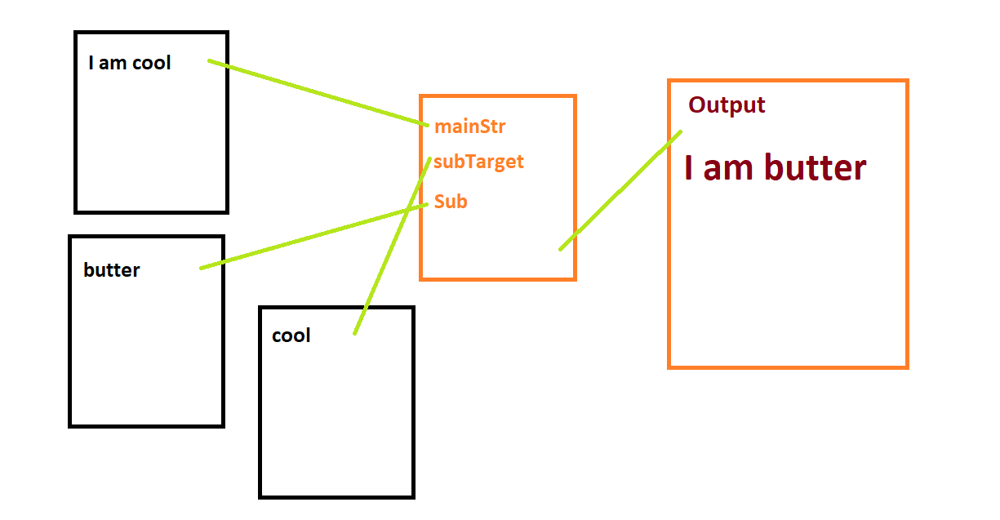

# textpedals

Textpedals is a visual and node based interface for manipulating text. The goal is for it to become an interface that allow transformation of strings.

The original idea was to make an interface that allows users to apply classic guitar pedal effects to pieces of strings. For instance applying a wah-wah effect to a string might result in something like this:

`This idea is stupid` ==> `Thwahs wahdwahwah wahs stwahpwahd`





The project is written in JavaScript in the [Vue](https://github.com/vuejs/vue) framework

### There is much to do

- [ ] Make it work **(WIP)**
- [ ] Add some lines, so you can see the child-parent  relationship **(WIP)**
- [x] Clean it up (find a better way to define inputs) -> probably with some kind of 
- [ ] Make some cool pedals / effects (**see below**) **(WIP)**
- [ ] Make a system for managing and dynamically adding these pedals?
- [ ] Somehow save the pedals and their connections when the website is closed

## Pedals to be done:

- [ ] Input source
- [x] Mixer
- [x] Wah-wah
- [ ] Delay
- [x] Reverb
- [ ] Substitution
- [ ] Loop
- [ ] Distortion
- [x] Reverse
- [ ] Freeze
- [ ] Trump (remove commas)
- [ ] southern pedal? --> replace full words with shortened words
- [ ] Volume (change between lower case - Camel Case - UPPER CASE, DOT. CASE. and exclamation marks)


## Project setup

```
npm install
```

### Compiles and hot-reloads for development
```
npm run serve
```

### Compiles and minifies for production
```
npm run build
```

### Run your tests
```
npm run test
```

### Lints and fixes files
```
npm run lint
```

### Customize configuration
See [Configuration Reference](https://cli.vuejs.org/config/).
